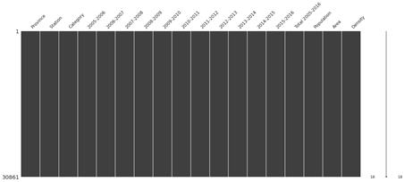
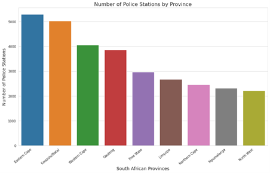
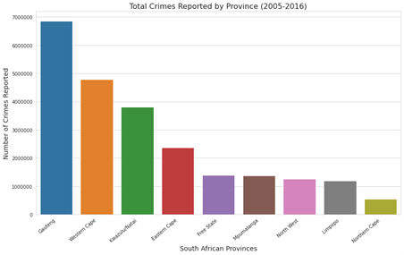
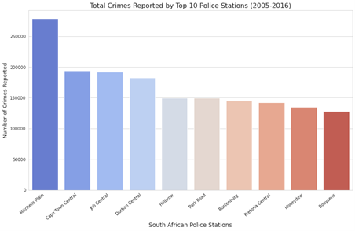
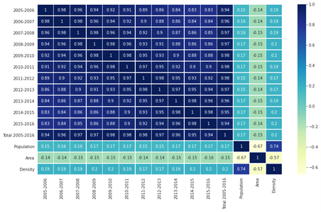
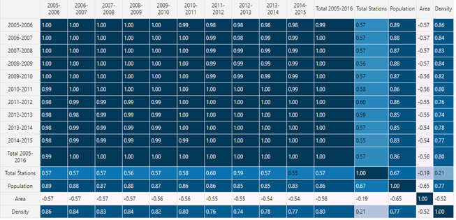
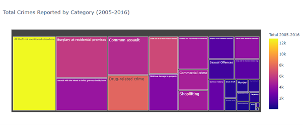

**Exploratory Data Analysis on the Crime Statistics in South Africa
between 2005-2016 Data Set**

**Introduction**

The South African Police Service (SAPS) has accepted a new and
challeging objective of ensuring that its crime statistics are in line
with international best practice. This will be achieved through a
Memorandum of Understanding with Statistics South Africa (Stats SA),
aimed at further enhancing the quality and integrity of the South
African crime statistics.

The dataset contains South African crime statistics, broken down per
province, station and crime type.

**DATA CLEANING**

**METHODS**

df_outer.isnull().**any**()

Columns of this dataset didn't have any missing values

df_outer.info()

To get information about datatype of dataframe

**VISUALIZATIONS**

mnso.matrix(df_outer)

Used missingno to visualize missing data and it clearly shows that
dataset doesn't have any missing
values.

MISSING DATA

Dataset didn't have any missing values

DATA STORIES AND VISUALIZATIONS

Findings:

-   Eastern Cape has the highest number of police stations in station
    comprising of 17.14% of all police station in the country

-   Kwazulu Natal has the second-highest number of police stations
    comprising 16.3% of all police station in the country

-   Western Cape and Gauteng are number three and Four respectively
    comprising 13.12% and 12.51% respectively.

-   The province with the least number of police stations is North West
    comprising 7.17% of police stations in the country.

Findings:

-   Gauteng has the highest number of crimes reported comprising 29.05%
    of all reported crimes.

-   Western Cape has the second-highest number of crimes reported
    comprising 24.66% of all reported crimes.

-   Kwazulu Natal has the third-highest number of crimes reported
    comprising 16.14% of all reported crimes.

-   Northern Cape has the lowest number of crimes reported comprising
    2.31% of all reported crimes.

Findings:

-   Mitchells Plain Police Station has the highest number of crimes
    reported comprising 29.05% of all reported crimes.

-   Cape Town Central Police Station has the second-highest number of
    crimes reported comprising 20.30% of all reported crimes.

> 

Findings:

> The is a high correlation between population and total crimes
> committed and density of provinces. Total stations also have a high
> positive correlation with total crimes commited.

Findings:

-   All theft not mentioned elsewhere is the highest form of crime
    committed comprising 17.64% of all crimes committed.

-   The second highest is Burglary at residential premises comprising
    11.71% of all crimes committed.

-   The least committed crime is Bank robbery comprising 0.0026% of all
    crimes committed.

**THIS REPORT WAS WRITTEN BY: Thabo Moeketsi**

